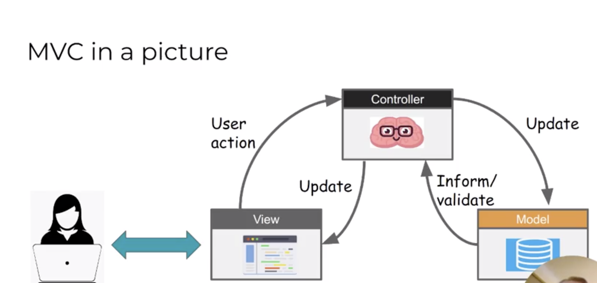
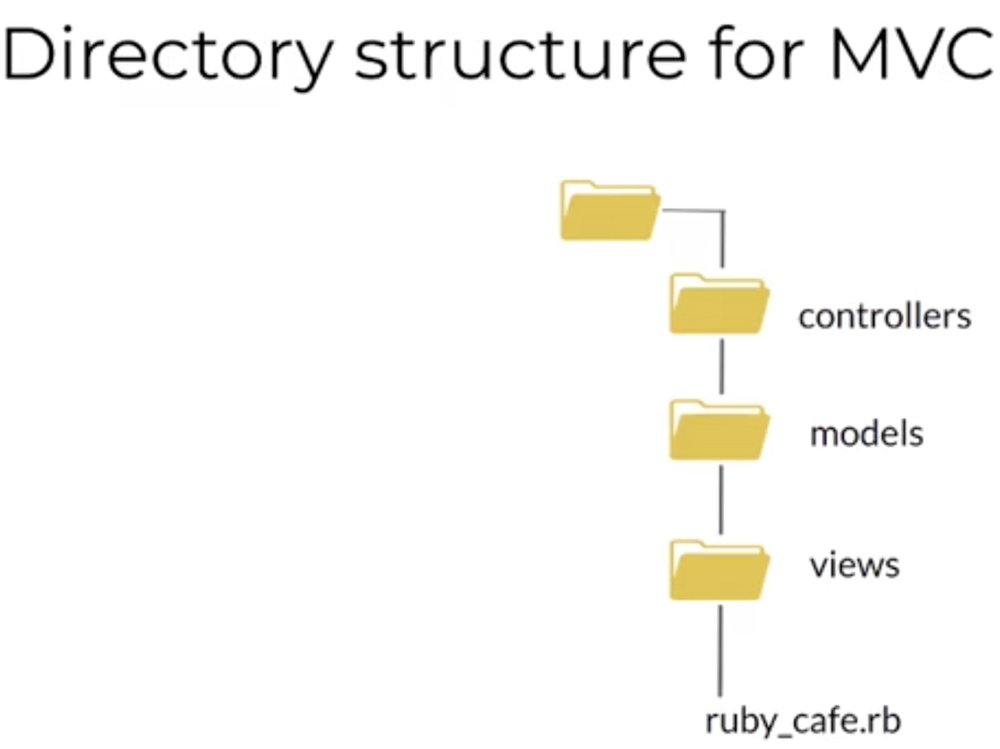

# Model View Controller 	

- This is the design pattern that is used in a rails application and it’s also used in other types of frameworks and architectures as well.

- The heart of the model MVC design pattern is that we breakdown the application structure/design into three main discrete parts. 

- Each part serves a specific function and this provides us some organisation and modularity.

- This really helps create some nice clean code that’s easy to understand. 

- This design pattern is used with a number of different languages and different types of applications but when we are studying rails

- It’s really Importent to understand MVC because it is the design pattern that is used and enforced by rails. 

- One of the big advantages of using the MVC design pattern in rails and knowing that that’s the design pattern that always gets used, is that we can take advantage of some conventions that rails provides for us.

- It makes it easier to automate building our application testing, testing our application and even deploying our application. 

# View 

- The view is what the user is interacting with

- This contains the display of our application data and also it exposes the way that the user can interact with our application. 

- That might be with buttons, or checkboxes for example

- There are all sorts of ways that we can provide graphical components that are user interacts with in order to use our application. 

- The view is our user interface and it is controlling what is actually appearing in the browser. 

- The view is responsible for displaying the content or the data of our application, which of course is received from the model.

- So it displays the information to the user and also gives the user ways to interact with that data through our application logic.  

# Model 

- The model is the representation of the data.

- The view of course id displaying the content that is stored in the model.

- ALL OF THAT is done through our third piece which is called a controller (View diagram arrows).

1. The user interacts with the view
2. Some action initiated by the user will prompt the controller to either:

	- Get information from the model 
		OR
	- Update the model:

		- So that if our user is interacting with our application in a way that adds data or changes data in our application.

		- Then the controller will be responsible for taking that action through the view and applying it to the model. 

3. Then of course as the model gets updated (as we update the data that is managed by our application) then the controller will update the view to reflect those changes in the data. 

- The model represents and manages the content of our application/ the data in our application and it is the part of our design pattern that
	
	connects to the data base and retrieves information updates wherever we are storing that data for our application.

- The model also is used to define the data structure for our data and the relationships between the different types of data in our application.

- Lastly, it’s the model in this design pattern that’s responsible for validating data. So since the model is the one that is aware of the data structure and what is expected 

	for the data in our application, it’s the model that we make responsible for validating any use of that data.

	- That include input from our user to update our data or retrieve data and ANY other data validation that is required by our application. 

# Controller

- You can think of the the controller as the brain of this MVC trio or the orchestrator.

- The view is interacting with the controller to get information from the model and to update information that is managed by the model. 

- In this way, the user goes through the controller to interact with our application. 

# Rails conventions

- Rails uses convention to help your application work so it is important to understand the Rails conventions.

- The image below illustrate the typical directory structure using MVC.

- First we have our application root directory at the top

- Within that root directory we have a directory for:

	- controllers
	- models
	- views 

- And then inside of our root folder we will have our application itself (in the example that is ruby_cafe.rb)

- The application will use the files the we defined in controllers, models and views.

