# MVC Introduction

## Links to lesson

- A link to the lesson can be found [here.](https://ait.instructure.com/courses/3520/pages/mvc?module_item_id=272763)

# The Cafe Models

- Assuming our app will implement a single user experience with our cafe (so one user places one order, and our cafe completes that order)…

- Our cafe model will need to have:

	- A menu with menu items.

	- An order.

	- The cafe itself.

# The Create the models 

- We will define each model in its own directory (see image below). 
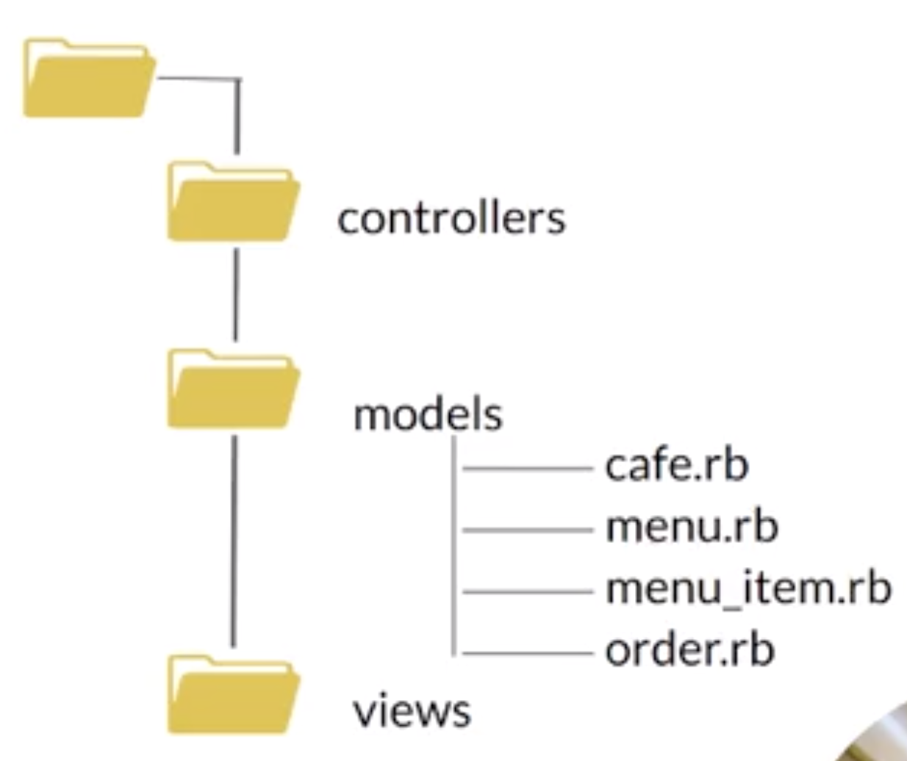

 **NOTE: we won’t include any methods that print output or take user input as that’s the job of the view.**

# Create the menu_item and menu model

menu_item.rb

- initialised with a name and a cost.

- Provides methods. 
	
	- name  -> returns the item name.

	- price  -> return the item price.

	- to_s  -> returns string representation of the item. 

menu.rb
	
- Initialised with an array of MenuItem.

- Provides methods.

	- get_items  -> returns the array of menu items. 

	- add_item -> adds an item to the menu.

	- item_cost(name) -> returns the cost of the item with the specified names.

# Creating app directories

- Open up your terminal and type these commands:

1.  Make a new directory for your app:

		mkdir mvc-ruby-cafe

2.  Change in to your app directory:

		cd mvc-ruby-cafe

3.  Generate a new Gem file using bundle:

		bundle init

4. Add rspec gem to include tests in your app:

		bundle add rspec

- These 4 steps should get us set up to develop your application. 

# Creating MVC and spec directories

- Next we want to create some more directories (keeping in mind the structure of an MVC app will have 3 directories)

1. Make a **controllers** directory:

	    mkdir controllers

2. Make a models directory:

	    mkdir models

3. Make a **views** directory:

	    mkdir views

4. Make a **spec** directory:

	    mkdir spec

# Creating directories within the models directory 

1. Change into models directory: 

		cd models 

2. Create a menu_item file:

		touch menu_item.rb

3. Create a menu file:

		touch menu.rb

4. Change back one directory: 

		cd ..

5. Open VS code:

		code . 

# Copying tests from previous Cafe app (ed video)

- **MenuItem** test and Menu test are copied into the spec file (this is done in the video).

- The **MenuItem** test tests that we can create menu item with a name and a price, and that we have access to the name and to the price. 

- The **Menu** test that we can create a menu, that we can add an item to our menu and check that the item was added. 

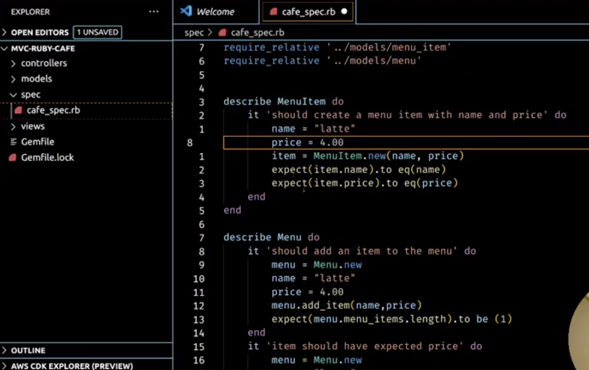

- One thing that will be different is instead of accessing menu items directory (see image below):

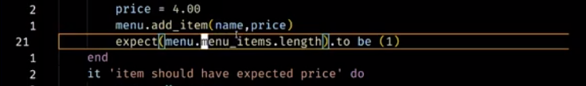

- We will add a method called get_items that gives us the menu items (see image below):

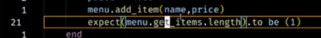

# Checking the tests fail the way we expect!

Open up terminal and run rspec:

		rspec 

- The first error we get is a **name error - uninitialised constant MenuItem** (see image below)

- This is good because that is how we expect this to fail!

- This fails because even though we have defined the files for our models, we haven’t actually added any code yet. 

- Therefore we should got to MenuItem and try and get the test to pass. 

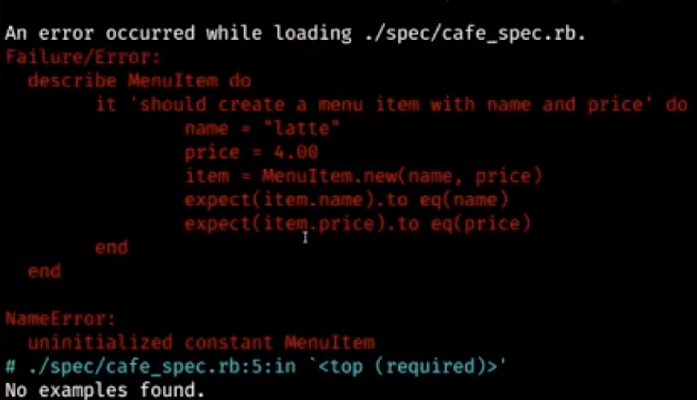

# Getting MenuItem test to pass

- Define a class called MenuItem

		class MenuItem

		end

- As mentioned above, in the initialised we will pass a **name** and a **price**. 
- And we will set our **instance variables** to those arguments passed in (name, price in this case).

		class MenuItem

		def initalize(name, price)
			@name = name
			@price = price
		end

		end

- Then we were also going to override the to_s method to get a nicely formatted string representation of our MenuItem. 
- (in the video the tutor copies the code from the previous app). 

		class MenuItem

		def initalize(name, price)
			@name = name
			@price = price
		end
		
		def to_s
			return “#{@name}” +  “ “ *(10-@name.length) + “ …$%.2f” % @price 
		end

		end
		
- This is just using *string interpolation* and a little bit of maths to print out the **menu item, name and price**. 

- Now with these changes, lets see if our tests will pass? 

# Checking the tests with updated code

- Open up terminal and run rspec:

		rspec 

- This time we get another **NameError: uninitialised constant Menu** (see image below)

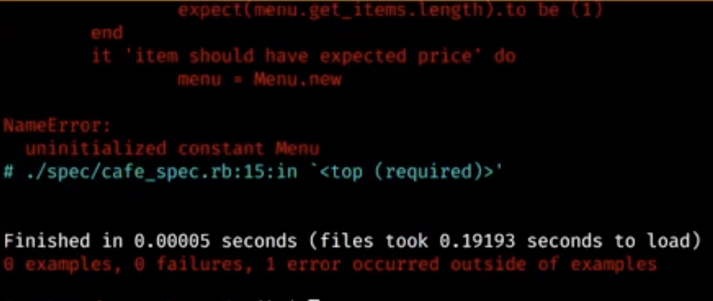

- To fix this, lets add a class of **Menu** in our menu.rb file 

		class Menu

		end

- Now let’s run the test again!

- Open up terminal and run rspec:

		rspec 

- Now we still have some **new failures**.

- Failure one is a: 

    - NoMethodError

	- undefined method ‘name’

	- on MenuItem

(see image below)

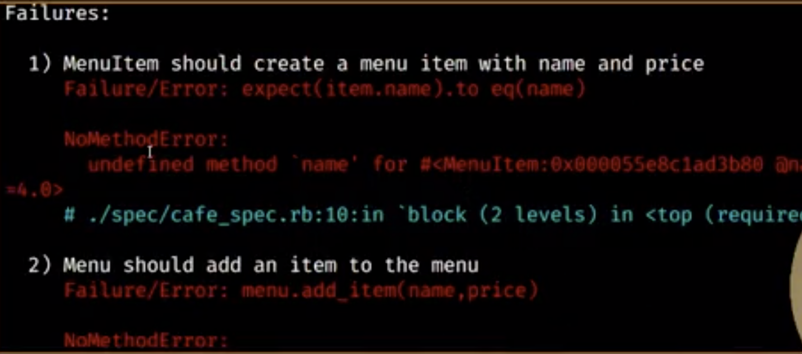

# Checking spec file

- If we look at our spec file, in our **MenuItem test**:

	- We create a menu item and then we try to access the **name** and **price** to do our test validation. 

	- BUT we have not yet exposed those two instance variables (@name, @price) to the outside.

	- We can do that most simply with an **attribute reader**.

		    attr_reader :name, :price

- Once we add this attribute reader to our **MenuItem class** (see image below), we can try the test again. 

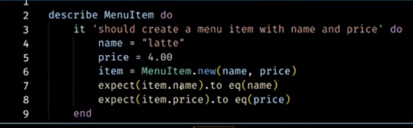

# Checking the tests with updated code

- Open up terminal and run rspec -fd (-fd just adds the documentation formatting):

		rspec -fd

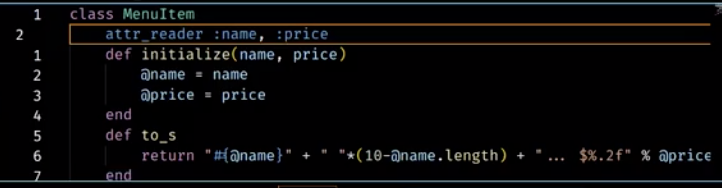

- Now our **MenuItem test** passes!

- BUT, we now need to look at our next failures (see image below).

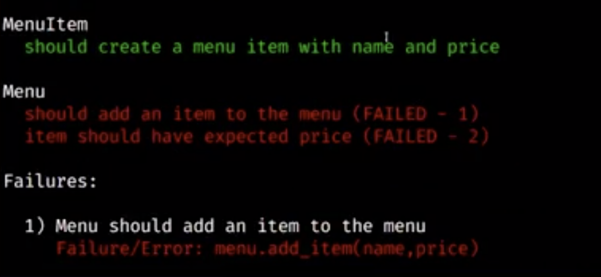

- This fails because we haven’t implemented Menu yet.

- Lets check out spec file for our Menu tests to see what we need to implement (see image below).

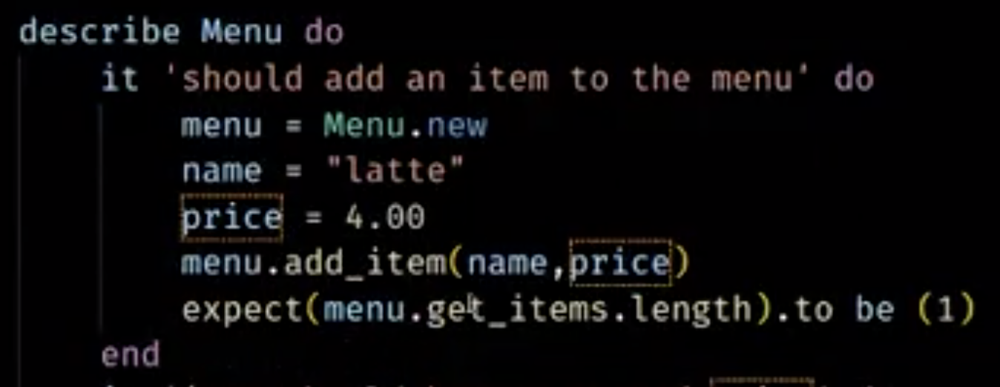

- In this test we try to add our menu items.

- To fix this., lets implement our menu class and see if we can get this test to pass.

- Go to your menu.rb file and add a menu class:

		class Menu

		end

- Then add an initialise method to your Menu class:

		class Menu

			def initialize 

			end
		end

- This time we won’t pass any arguments/parameters to our initialise method BUT

- We will initialise our menu_items array to an empty array 

		class Menu

			def initialize 
				@menu_items = []
			end
		end

- The next thing we will do is create an add_item method, which will take name and price as arguments.

- This will add an item to our menu.

		class Menu

			def initialize 
				@menu_items = []
			end

			def add_item(name, price)

			end
		
		end

- Now, when we add an item to our menu, we actually create a menu item from it. 

- So lets bring in our menu_item class with require relative 

		require_relative ‘./menu_item’

- Adding this will allow us to create a new MenuItem object:

		
		class Menu

			def initialize 
				@menu_items = []
			end

			def add_item(name, price)
				menu_item = MenuItem.new(name, price) 
			end
		
		end

- Then we can just push that into our empty array:

		class Menu

			def initialize 
				@menu_items = []
			end

			def add_item(name, price)
				menu_item = MenuItem.new(name, price) 
				@menu_items << menu_item
			end
		
		end

