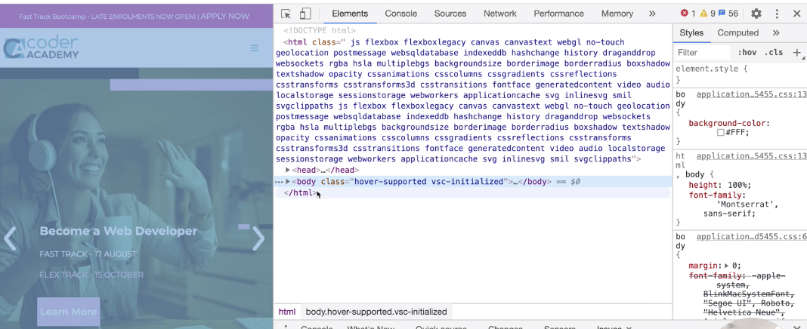

# Rails Intro

## link to lesson 

- A link to the lesson can be found [here.](https://ait.instructure.com/courses/3520/pages/rails-intro?module_item_id=272764)

# What is Rails?

- Rails was created in 2003 by David Heinemeier Hansson, while working on the code base for BaseCamp, a project management tool.

- David released it as an open source code in July 2014. It has stuck to three primary principles:

	- Ruby Programming language 
	- Model-View-Controller Architecture
	- Programmer-happiness 

- Rails is an app that quickly helps us build an MVP (minimum viable product).

- If you have an app idea and you quickly want to make it out to the market before anyone else comes up with the same idea, Rails is a best tool to begin because of how quick it is to build an MVP.

# Framework

- DRY 
	
	- We abstract our code in such a way so that we are not writing the same code over and over.

    - Rails also has built in commands that can generate lots and lots of boilerplates for us so we don’t have to write it every time we need to create a new app or if we wish to add features to an existing app. 

# What is a boilerplate/template/framework?

- A boilerplate is a unit of code that can be included in many places without alteration. 

- Think about when we were creating out HTML websites. There was certain code we had to write for every page. Wouldn’t it be better if that code was autogenerated for us?

- If you look at any page (coder academy in this example) you can inspect the page and notice the head page and the body tag are repeated on every page.  

# Convention over Configuration

- Rails follows a principle referred to as “Convention over Configuration”.

- It is a simple concept that is primarily used in programming. 

- It means that the environment in which you work (systems, libraries, language…) assumes many logical situations by default. 

- If you adapt to the conventions rather than creating your own rules each time, programming becomes an easier and more productive task.

- The goal is to decrease the number of decisions the programmer has to make and eliminate the complexity of having to configure each of the areas of application development. 

- The immediate result is that you can create many more things in less time. 

- It does however require a larger learning curve at the beginning because you need to become familiar where everything is located and the convention that is being used. 

- In any case, to use a system in which most things are pre-configured is always more productive than to use a completely open system in which you have to set all rules and take all decisions. 
