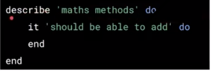

# Testing ruby with Rspec

## Link to lesson

- a link to the lesson can be found [here.](https://ait.instructure.com/courses/3520/pages/test-driven-development?module_item_id=272750)

# Rspec

- Rspec can be used in any ruby project (rails too). 

- Rspec is a testing framework for Ruby that is used to write automated tests, and can be used in TDD.
- It is a collection of Ruby Gems
- Provides libraries for writing tests (respect-core), test assertions (respect-expectations), and testing mocks (rspec-mocks]]

# Getting started - install the rspec gems

1. One way to install rspec

- inside your terminal add 

        gem install rspec

- This will install the gem globally to the local directory your in within your terminal.

2. Second way to install rspec

- Run rspec init inside of a project directory

- Then use bundler to manage rspec as a dependency as an application

# rspect-core

- Provides the structure for writing tests and also for controlling which tests are run int he format of the out put that we get.

- Introduces the words describe and it to express tests like a conversation. 

- For example: we may have  collection of methods that perform mathematic operations and we could right tests for those methods using the syntax below 

- We start with what is called a **describe block**. This is a way to **group tests together**. 

- We can use the keyword **describe** and then specify a string that describes this block of tests that we are about to define .

- Then we use the **do** keyword to signify the beginning of the describe block and the **end** keyword to signify the end of the describe block .

- Inside of that describe block, we can define as many test scenarios as we’d like using the **it** keyword.

- The **it** keyword is used to define a single test and like **describe**, the first argument we pass to it will be a *string*. 

- The *string* describes what particular thing this single test will test. 

- For example:

    - Let’s say that in our maths method (example) an add method and this particular test is going to test that our maths methods are able to add. 

    - In this test we might execute a function called add and test that we get back the results that we expect to get.

    

# rsepc-expectations

- Used to assert expected test results 

- Many built in matchers 

	- Identity

		 - to be, to eq

	- Comparisons 

		- to be <
		- to be >

	- Regular expressions 

		- to match

	- Types/classes

		- to be_an_instance_of, 
		- to be_of_a_kind_of

	- Truthiness 

		- to be_truthy
		-  to be _falsy 
		- to be_nill 
		- to_not be_nill

	- Errors 

		- to raise_error