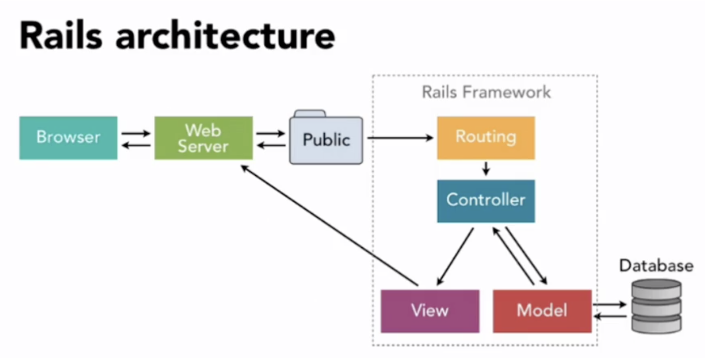

# Routes, Controllers, and Views

## Link to lesson

A link to the lesson can be found [here.](https://ait.instructure.com/courses/3520/pages/rails-routes?module_item_id=272774)

# Why Routes?

- Routing is a key part of all websites. 

- The content of a website should be organised in several URLs.

- Different URLs and different HTTP methods require different routes. 

- Routing is needed whenever we want to use a URL in our app.  

# How does Rails work?

- This image  is useful in understanding the behaviour of the rails framework. 

- The bottom of the image illustrates the MVC architecture (Model, View, Controller) 

	- The model, where we define and store the data thanks to our database. 

	- The controller, which manages everything and establishes connection between the model and the view. 

	- We can see the the view is the one that is going to show the content of the website in the browser. 

- But how does Rails know which view it has to render? To answer this, we can look at the arrows in the diagram. 

	- We can see that the HTTP request is going to arrive at the Routing first. 
	- Then, once the Routing has processed the request, the controller can start managing everything. 

Steps of the process (overview)

1. Client sends a HTTP request.

2. Routes connects URLs to controller actions.

3. Controller executes actions and renders view. 

Step 1: Client sends a HTTP request. 

-  When the user types a URL into the browser, and that URL points to a running rails server, the servers reads the path and looks for a route. 

- The first route that matches is the one that is uses. 

- Actually, every time we type a URL and press enter or we click on a link, a HTTP request (GET, POST, PUT/PATCH, DELETE) is sent to the server. 

Step 2: Routes connects URLs to controller actions

- The rails server finds the first route that matches the HTTP method and path (the URL) and directs the request to the associated controller action. 

- Routes are defined in the config/routes.rb file and map HTTP verbs and paths to controller actions. 

- Controller actions are another name for controller methods and they are found in the controllers source code. 

