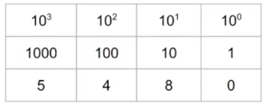

# Bases

## Link to lesson

- A link to the lesson can be found [here.](https://ait.instructure.com/courses/3520/pages/cs-fundamentals-bases?module_item_id=272780)

# What is a base?

- A set of digits used to express numeric values

- In any base we have as many digits as the base number

- in base 10, we have digitals:

	0, 1, 2, 3, 4, 5, 6, 7, 8, 9

- With those 10 digits, we can express any numeric value.

- Base 10 is familiar as it is the decimal system. 

- When we run out of digits from one place, we simply move to the next place.

Example with base 10:

…7, 8, 9

- We then go to the next number

…10, 11, 12 ……..19

- And the same goes on as we increment digits in the 10’s place

…..20, 21……………99

- At this point we just move to the 100’s place

……100, 101, 102 etc

Binary

- Decimal is base 10.

- Binary is base 2. 

- Therefore binary only has 2 digits.:

	0, 1

Translating decimal to binary  (1 -5) 

- Representing the decimal 1 in binary is straight forward:

		1 decimal = 1 binary 
		
- Given binary does not include 2 as a digit, we have already run out of digits.

- Therefore we need move to the next place:

		2 decimal = 10 binary 

- At this point, we still have another digit we can increment before moving to the next place

- Therefore we just need to increment the next digit:

		3 decimal = 11 binary 

- At this point, we have run out of digits again, so we will need to move to the next place:

		4 decimal = 100 binary 

- Just like before, we have another digit we can increment before moving to the next place

		5 decimal = 101 binary 

# Table representation



# Place Values - Decimal 

- In any number, the place value is the digit multipliedd by its ‘place’ in the number. 

- In base 10 we can think of the places as:

- The 1’s place

- The 10’s place

- The 100’s place

- The 1000’s place (and so on)

- Each one of these places is an increasing power of 10 

- The below image illustrates the example of the digit:

	5480

- If we were asked what the place value of 4 is in the number 5480. 

- We can get the place value by multiply the digit 4 by the value of its place which is 100 in this example.

- Therefore the place value of 4 in 5480 is equal to 4 x 100 = 400.

Place Values - Binary

- In binary (and in every other base) place values are exactly the same in that the digit value gets multiplied by its place in the number.

- The only difference with binary is that the digit is always either a 0 or a 1 . 

- Unlike decimal (base 10) where we have increasing powers of 10, in binary (base 2) we have increasing powers of 2. 

- In base 2 we can think of the places as:

    - The 1’s place

    - The 2’s place

    - The 4’s place

    - The 8’s place 

    - The 16’s place 

    - The 32’s place

- The below image illustrates the example of the digit:

	101100



    - In the 1’s place we have 2 to the 0 power

    - In the 2’s place we have 2 to the 1st power (which is just 2)

    - In the 4’s place we have 2 to the 2nd power (which is just 2 x 2 = 4)

    - In the 8’s place we have 2 to the 3rd power (which is just 2 x 2 x 2 = 8)

    - In the 16’s place we have 2 to the 4th power (which is just 2 x 2 x 2 x 2 = 16)

    - In the 32’s place we have 2 to the 5th power (which is  just 2 x 2 x 2 x 2 x 2 = 32)

- The way the we would calculate the place value of a digit in a binary number is the same way as we would in base 10. 

- If we wanted to know the place value of the first 1 in the binary number 101100 (example image):

	-  We take the 1 and multiply it by its place value (which is 32 in this example)

	- Therefore its place value is 1 x 32 = 32 (in decimal)

Converting from Binary to Decimal 

- Another way to think about determine the place value of a digit in a number is just converting from the number system (binary in these examples) to decimal. 

- We do this because then we can make sense of the number given our brains are not used to thinking in binary or hexadecimal or base 5 etc. 

- We are used to thinking in base 10. 

- When we hear a number and it is expressed in base 10, we can have some idea of what that number represents. 

- So when we are calculating the value of a number in another base, what we are talking about is “how do we represent that number in base 10?”

- We can convert any number in any base to base 10 using the same method that we used above. 

- The method is:

	- We write out the place value for each of the digits (in this example we have the digits 101110). 

	- Once we represent each of the place values for those digits in the number we can then write it out in expanded notation. 

	- Where we multiply each digit by its place value. (1 x 32) + (0 x 16) + (1  x 8) + (1  x 4) + (1 x 2) + (0 x 1) 

	- In this example we have a 0 in the 16’s and 1’s place so we don’t have to add them (they are just 0): (1 x 32) + (1  x 8) + (1  x 4) + (1 x 2) 

	- Therefore we have 32 + 8 + 4 + 2 = 46

	- 46 is the value of this number 101110 in decimal or base 10	