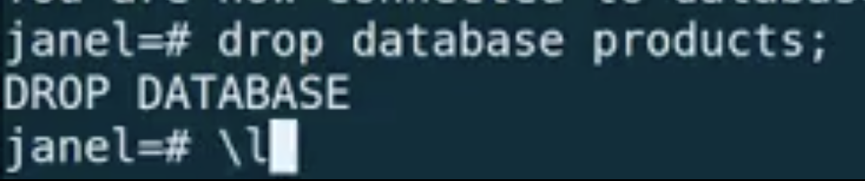
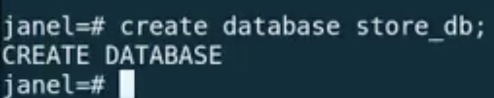
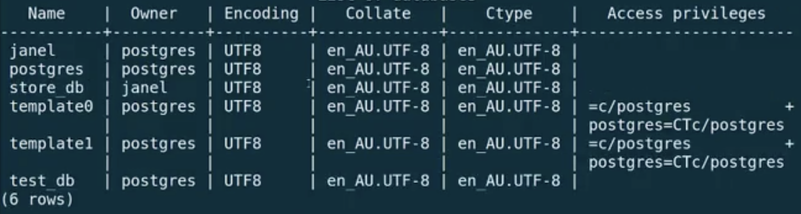
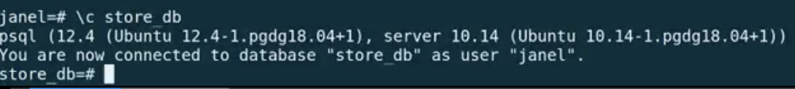
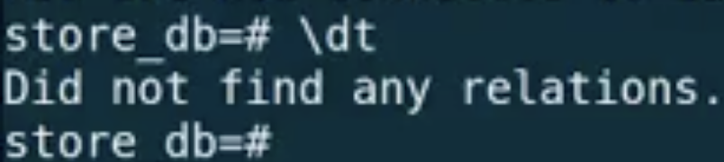
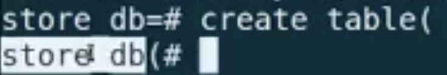
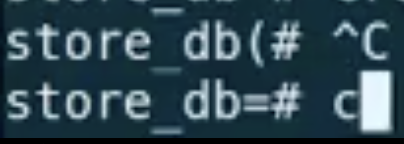
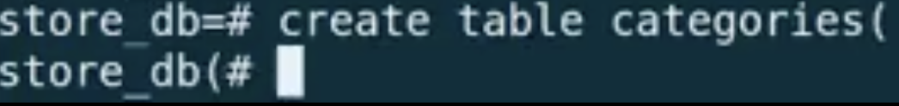
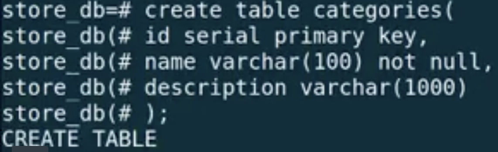

# Intro to SQL - psql

## Link to lesson 

- A link to the lesson can be found [here.](https://ait.instructure.com/courses/3520/pages/intro-to-sql?module_item_id=272778)

Drop database

- Just like we can say CREATE DATABASE we can also drop a database (don’t forget the semicolon)

		drop database products;

- We can double check it has been dropped with the listing command:

		\l

# Create New database

- use the command:

		create database (name of db);

- don’t forget the semicolon. 

- Now check with the list

		\l

- As you can see in the image above, store_db is now listed in our table.

- So lets go ahead and connect to our store_db database:

		\c store_db

- You will then see a prompt that says you are now connected to the database “store_db” (see image below):

- If we do a backslash dt to list any tables if will output “did not find any relations” (see image below):

- You may remember that relations is just a word that means tables but it can actually mean more than just tables.

- That is why relations is used here. 

- For most of the time, when you see the word relations in this context, we are talking about tables. 

# Create New table

- If we wanted to create a new table we could start with:

				create table(

- After hitting enter you will notice that the prompt has changed.

- Now we are inside of that open parenthesis.

- What we do inside of the parenthesis is we:

	- define our columns. 

- Now we forgot to give our table a name!

- Lets use the keys control and c which will take us OUT OF the middle of the command we were typing in (see image below):

- In other words, we are no longer inside of the ()

- Lets create a table called “Categories”

		create table categories(

- Now lets create an id for this table:

		id serial 

- if you look back at the documentation you’ll see that:

	- serial is the same as integer except that PostSQL will automatically generate and populate values into the SERIAL column. 

	- This is similar to AUTO_INCREMENT min MySQL.

- And we are going to say that this is our Primary Key

		id serial primary key

- This is one way (a simple way) if we have a single column that is going to make up our primary key.

- We can put the constraint declaration on the line where we are defining the column. 

- So now that we are done with that column definition we will put a comma

		id serial primary key,

- Our category will also have a name and that will have a varchar of 100 

- varchar is just the type for a variable character text type and this says it is a maximum of 100 characters. 

	
		
		name varchar(100)

- Then we are going to add the not null constraint:

		name varchar(100)not null, 

- Then lets say that our category can also have a description with a varchar of 1000:

		description varchar(1000)

- But we won’t make it mandatory - so we won’t make it null.

- So when I am done defining my columns and any additional constraints:

    - Then we can close of the parenthesis 
    - And put our semicolon 

		);

