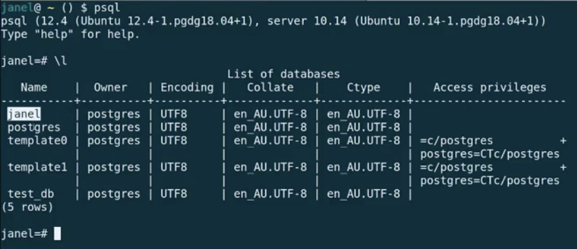

# Intro to SQL - psql

## Link to lesson 

- A link to the lesson can be found [here.](https://ait.instructure.com/courses/3520/pages/intro-to-sql?module_item_id=272778)

Preparation

- In order to be prepared for this lesson, you should have the latest stable release of PostgreSQL installed and configured.

Link to lesson for downloading and installing PostgreSQL can be found [here.](https://edstem.org/courses/4965/lessons/5866/slides/42288)

- Running this command in the terminal:

		psql

- Should connect to your username database. 

- This is like running the irb command in the terminal:

		irb

- More specifically, this is because when you run irb, you are then in an *environment* and the same thing is true when running:

		psql

 # List current database       

- To list the databases that are currently associated with the postgres server we are connected to:

    - we run (backslash and the letter L; not capitalised) 

		    \l

- This image displays all of the databases that are currently defined in the database server that *janel* is connected to.

    - janel
    - postgres
    - template0
    - template1
    - test_db

# Helpful Links

- https://www.postgresqltutorial.com/

# What if we want to run psql to connect to something other than our default database?

- The following command connects to a database under a specific user. After pressing Enter PostgreSQL will ask for the password of the user.

		psql -d database -U  user -W

- This comes from *17 Practical psql Commands That You Don’t Want To Miss* at https://www.postgresqltutorial.com/

# What if we are logged in to psql and we want to connect to a different database?

- We can always just use a backslash c or backslash connect and pass the database name:

		\c dbname username

- This also come from *17 Practical psql Commands That You Don’t Want To Miss* at https://www.postgresqltutorial.com/