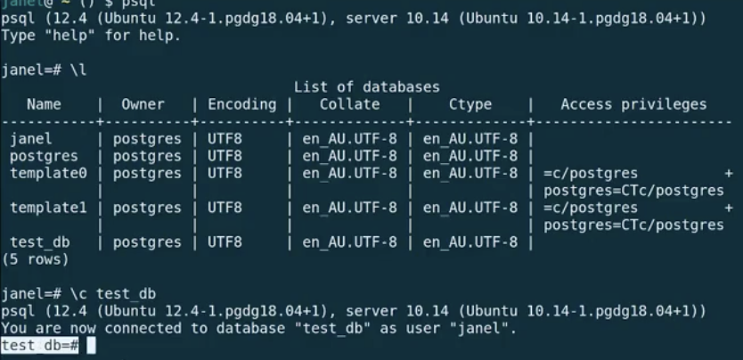
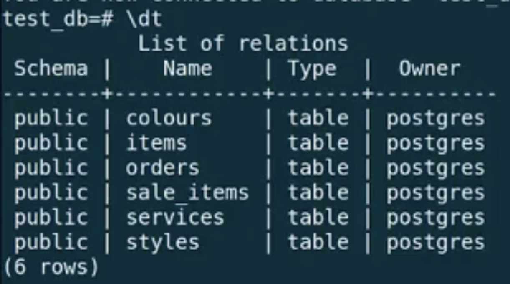
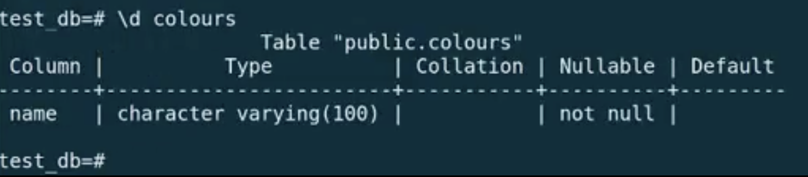
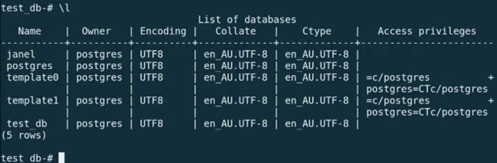
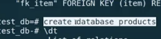
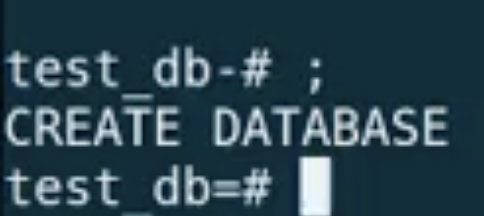
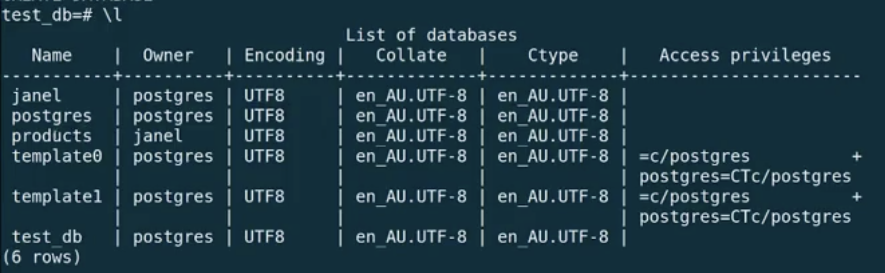
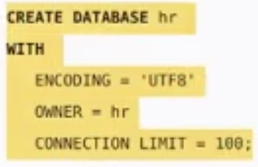
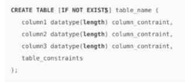

# Intro to SQL - psql

## Link to lesson 

- A link to the lesson can be found [here.](https://ait.instructure.com/courses/3520/pages/intro-to-sql?module_item_id=272778)

Preparation

- In order to be prepared for this lesson, you should have the latest stable release of PostgreSQL installed and configured.

Link to lesson for downloading and installing PostgreSQL can be found [here.](https://edstem.org/courses/4965/lessons/5866/slides/42288)

- Running this command in the terminal:

		psql

- Should connect to your username database. 

- This is like running the irb command in the terminal:

		irb

- More specifically, this is because when you run irb, you are then in an *environment* and the same thing is true when running:

		psql

 # List current database       

- To list the databases that are currently associated with the postgres server we are connected to:

    - we run (backslash and the letter L; not capitalised) 

		    \l

- This image displays all of the databases that are currently defined in the database server that *janel* is connected to.

    - janel
    - postgres
    - template0
    - template1
    - test_db

# Helpful Links

- https://www.postgresqltutorial.com/

# What if we want to run psql to connect to something other than our default database?

- The following command connects to a database under a specific user. After pressing Enter PostgreSQL will ask for the password of the user.

		psql -d database -U  user -W

- This comes from *17 Practical psql Commands That You Don’t Want To Miss* at https://www.postgresqltutorial.com/

# What if we are logged in to psql and we want to connect to a different database?

- We can always just use a backslash c or backslash connect and pass the database name:

		\c dbname username

- This also come from *17 Practical psql Commands That You Don’t Want To Miss* at https://www.postgresqltutorial.com/

For example if i wanted to switch to the test tb I can type:

		\c test_bd

Now the prompt will say that it is connect to test db

# List all tables:

		/dt

(See image below for display table in video):

- Names of the tables:

	- colours

	- items

	- orders

- You can see that they were created with postgres

Describe a table:

		\d 

- then you can add the table name

- For example:

		\d colours 

- You can see that colours is made up of:

    -  a single column called name 

    - that has a character varying type 

    - With a length of 100

    - And it has a constraint on it that it cannot be null

- We can look at the column structure of any of these tables by using:

		\d

- then the name of the table. 

- This is giving us information about the restructure of a particular database (test database in this example).

# Create new database:

- type command:

		create database (add database name)

- For example if you called you db “products” 

- The command will be

		create database products

- After entering this command type:

		\l

- At this point, we can not see the database products in our list of tables (this gets the instructor all the time).

**NOTE: SQL COMMANDS MUST END WITH A SEMICOLON**

- if you don’t put a semicolon, then they don’t execute. 

- If we look back at when we created out products database (see image below):

- We did not include a semicolon.

- So if we just add a semicolon to our terminal:

		;

- We will see the output CREATE DATABASE (see image below):

- Now if we take a look again at our list of tables:

		\l

- Now we can see our products database (see image below):

- You can also see that because we didn’t specify an owner, it defaulted to the user which is janel in this example.

- You should see in all of the documentation a semicolon at the end of a command (very important)!

# SQL statements & the semicolon:

**NOTE: SQL COMMANDS MUST END WITH A SEMICOLON** 

- It is very important that every SQL statement that we execute (not every line of the statement - see image below) **HAS TO HAVE A SEMICOLON**. 

- The image above, whilst it is a multiple line statement, is STILL A SINGLE statement to create a database.

- We know it is the end of the statement when we see the semicolon. 

- That is what tells the interpreter that we are done with this statement and this statement should be executed. 

# Create a table:

- It is a single statement to create a table.

- Optional (if not exists) which will prevent errors from being generated if the table already exists. 

- We comma seperate the columns. 

		CREATE TABLE [IF NOT EXISTS] table_name (
   			column1 datatype(length) column_contraint,
   			column2 datatype(length) column_contraint,
   			column3 datatype(length) column_contraint,
   			table_constraints
		);
