# Manipulating Data

## link to lesson

- A link to the lesson can be found [here.](https://ait.instructure.com/courses/3520/pages/intro-to-databases?module_item_id=272777)

- Remember that the manipulative features are about manipulating the data in our tables. 

## Manipulating Data

- Insert Data into tables.

- Query data with SELECT. 

- DELETE data from tables.

## Inserting Data

- Specify column names in any order and match order of values.

- Error if required (not null, primary key) column values are missing. 

		INSERT INTO <table_name> (COLUMNS) VALUES

- We give the list of columns for which we will insert data in the order of which we will specify the values. 

- Notice here in the example below:

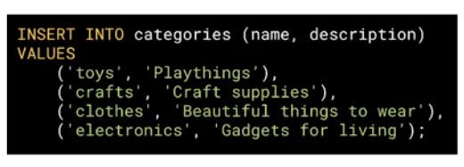

- We are specifying name and description for categories.

- The expectation is that after VALUES statement we have a:

- Comma separated list of values enclosed with parenthesis.

- With the actual values that we want to insert into those columns, comma separated inside of those parenthesis. 

- The order of those values has to match the order of the columns.

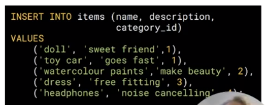

- When you issue this insert command or statement, if you do not specify a value for a column with a not null constraint

	- You will get an error.

- Therefore we will get errors if we don’t meet all of the constraints that we have defined when defining the structure of the table. 

## Example database

 - Remember that the order that we put the columns in doesn’t have to match anything EXCEPT the values that we put into the subsequent statement.

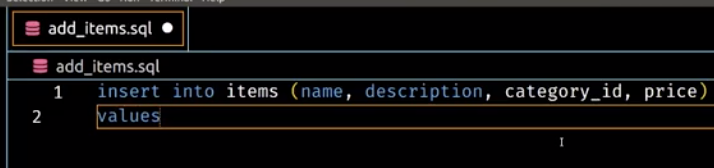

- We are going to insert some values:

	- A car that’s a toy.

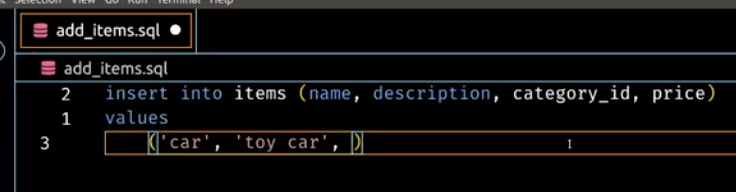

- Now lets look at our category id’s (see image below)

		select * from categories;

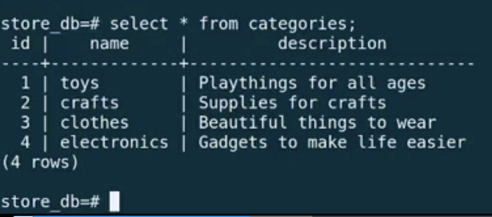

- So we will put this in category 1.

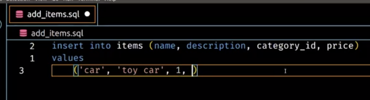

- And we will make it $5.

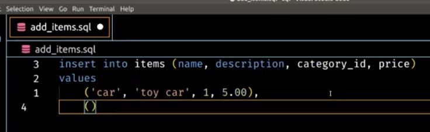

- Make sure we comma seperate these values that we want to seperate in the table. 

- Now let's add some paints that are water colours. 

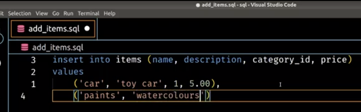

- Now lets look at our category id’s again to see what category we should put this in (see image below)

- Let’s put it into category 2.

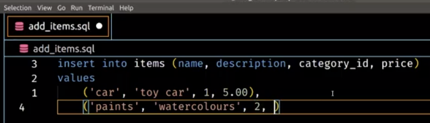

- And let’s say that it’s $15.30

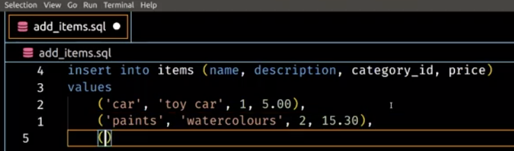

- Now let’s add another item, a dress that fits all sizes and we will put it in the cloths category (3) and make it $20.

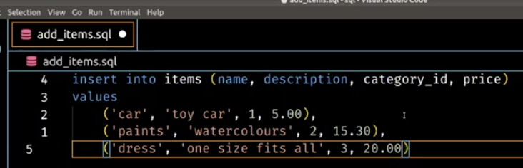

- So you can see that we are able to include as many items as we wish.

- When we are done we need to include the semicolon.

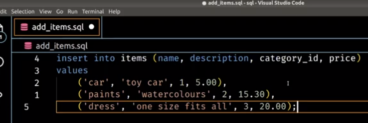

# Executing file from psql environment 

To execute a file inside your psql environment:

		\i 

Then add your file path (below is from the example in the video)

		\i ~/sql/add_items.sql

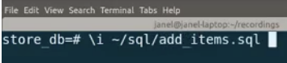

- It looks like it has succeeded.

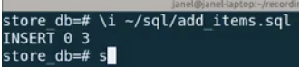

- When we are querying the data in our table we use a select method

		select *

- The star (splat) means:

	- I want you to select all columns. 

- Alternatively, we could put columns names after select.

- In this example we will use the * 

- Then we say from 

- and the name of the table

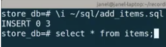

- This (image above) is the minimal information we need for a select statement. 

- That will return all of the items in the table columns (see image below):

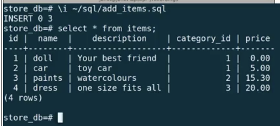

# Just seeing only “name”

		select name from items;

- This will return only the names.

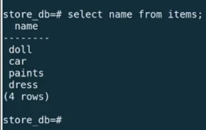

# Just seeing only the price of “name”

		select name, price from items;

- (notice that we comma seperate the two columns)

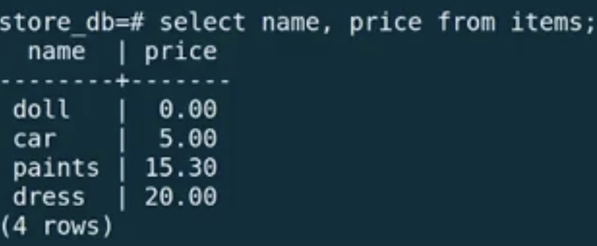

- It will get returned in the order that I specified. 

