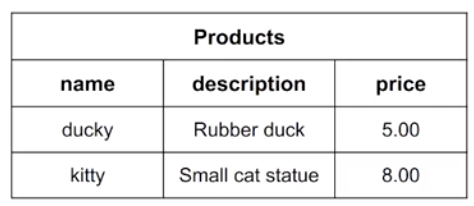
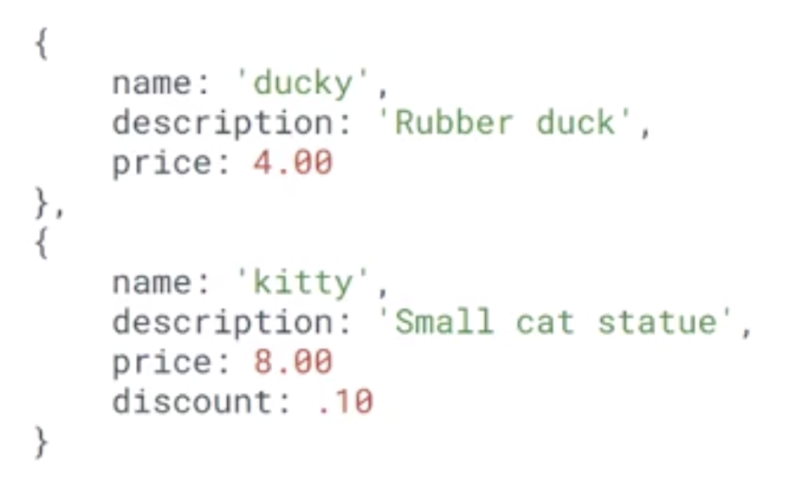

# Introduction to Databases

## link to lesson

- A link to the lesson can be found [here.](https://ait.instructure.com/courses/3520/pages/intro-to-databases?module_item_id=272777)

## Data vs Information

- We first need to distinguish the difference between data and information. 

## Data 

- Raw, unfiltered, unrelated material that can be in any format (text, images, numbers etc).

- Data is meaningless.

## Information

- Consists of collected and related data that has been analysed.

- We filter information and we process information. 

- Delivers meaning.

# What is a Database?

- A database is just an organised and structured collection of related data. 

- What we do with a database is we store related pieces of data together. 

- This allows data to be used as information by collecting and storing the data in a meaningful way, enabling use of the data. 

- When we talk about databases, we’re typically talking about some physical structure that we can access with a Database Management System (DBMS). 

    - There are two ways we can structure this database to create information and one of them is called a Relational Database.

# Relational Databases (overview)

- Relational databases organise data in tables with rows and columns.

-  The table represents a relation because it defines the ways that the data relates as information. 

- The columns indicate attributes (also known as domains or types) for the data. 

- The rows (also called tuples) represent individual records in the table. 

- One example of a Relational Database is a spreadsheet. 

# Nonrelational Databases (overview)

- Data is organised as a collection of documents. 

- Compared to relational databases, collections are like tables and documents are like rows. 

- Attributes for data are defined (like columns for relational databases), but are loosely structured. 

- One of the big differences with a nonrelational database is the we don’t have a well defined structure. 

- We don’t always have attributes that are well defined or consistent with all entries or representations of our data.

- Therefore, we could have one document in our collection that has a discount attribute and maybe not all documents have that attribute. 

- This type of database is really useful when we have organic data. 

- For example when we have dynamic structure, that it is likely to change or be different between instances of our pieces of information. 

# Relational Databases

