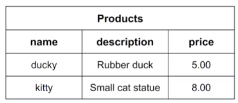
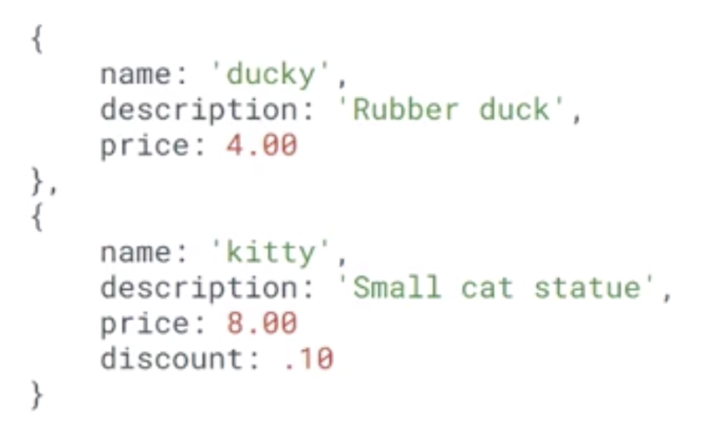
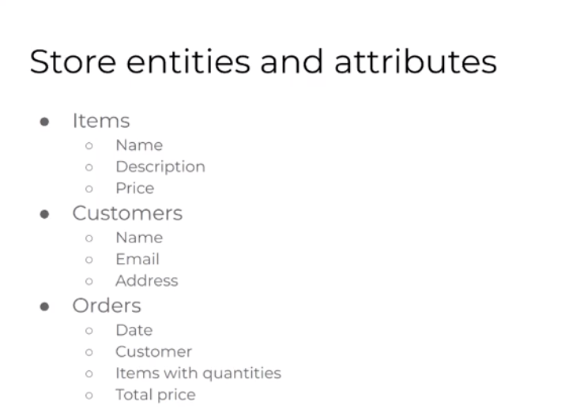
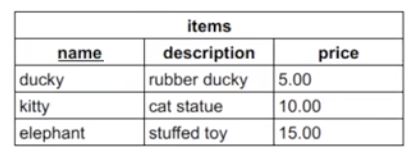
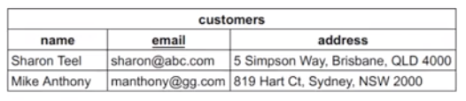
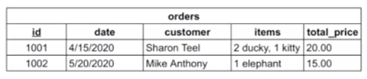

# Introduction to Databases

## link to lesson

- A link to the lesson can be found [here.](https://ait.instructure.com/courses/3520/pages/intro-to-databases?module_item_id=272777)

## Data vs Information

- We first need to distinguish the difference between data and information. 

## Data 

- Raw, unfiltered, unrelated material that can be in any format (text, images, numbers etc).

- Data is meaningless.

## Information

- Consists of collected and related data that has been analysed.

- We filter information and we process information. 

- Delivers meaning.

# What is a Database?

- A database is just an organised and structured collection of related data. 

- What we do with a database is we store related pieces of data together. 

- This allows data to be used as information by collecting and storing the data in a meaningful way, enabling use of the data. 

- When we talk about databases, we’re typically talking about some physical structure that we can access with a Database Management System (DBMS). 

    - There are two ways we can structure this database to create information and one of them is called a Relational Database.

# Relational Databases (overview)

- Relational databases organise data in tables with rows and columns.

-  The table represents a relation because it defines the ways that the data relates as information. 

- The columns indicate attributes (also known as domains or types) for the data. 

- The rows (also called tuples) represent individual records in the table. 

- One example of a Relational Database is a spreadsheet. 

# Nonrelational Databases (overview)

- Data is organised as a collection of documents. 

- Compared to relational databases, collections are like tables and documents are like rows. 

- Attributes for data are defined (like columns for relational databases), but are loosely structured. 

- One of the big differences with a nonrelational database is the we don’t have a well defined structure. 

- We don’t always have attributes that are well defined or consistent with all entries or representations of our data.

- Therefore, we could have one document in our collection that has a discount attribute and maybe not all documents have that attribute. 

- This type of database is really useful when we have organic data. 

- For example when we have dynamic structure, that it is likely to change or be different between instances of our pieces of information. 

# Modeling data

- The first step in database design is modelling the data. To do this we:

	- Define entities. 

	- Define attributes (The qualities of those attributes) 

	- Define relationships between attributes.

## Entities and attributes 

- When we model a problem or a situation, we have to define the entities and their attributes. 

- Lets consider modelling a store.

- What are some of the entities or objects we have to model? What are their attributes?

## Store entities and attributes 

- So if we think about a store, we will realise that we will sell things some product or service in our store. 

- So we’ll have some sort of item and those items will have attributes (like name, description and price).

- There could be a lot of other attributes (unique identifiers or a discount for example). 

- We’ll also have customers, which is pretty clear in any kind of marketplace. 

- We’ll have sellers too. 

- Then we’ll have orders, which are what are created when a customer purchases something from the store. (When a customer makes their shopping cart).

- Then we will need orders. 

- **Items**

    - Name
    - Description
    - Price

- **Customers** 

    - Name
    - Email
    - Address

- **Orders** 

    - Date
    - Customer 
    - Items with quantities 
    - Total price

# First step to database design

- We start to think about to objects that we need to model and then the attributes of those models. 

# Second step to database design

- What are the unique attributes, the unique identifiers (Primary Key)

# Primary Key

- This primary key maybe one or could be multiple attributes and those attributes will **uniquely identify** each **record** in our **table** for that object.

- One or more columns (attributes) that uniquely identify a record in the table.

		- Items (item name)

		- Customers (email)

		- Orders (unique id)

## Items

- If we think about items and we look at the list of attributes that we have called our so far (see image below):

- We can assume that our item name will be unique in that no two items will have the same name. 

- If it’s possible that two items might have the same name, then we would have to come up with ANOTHER primary key. 
	
	- Either by combining name with some other attribute in the table OR

	- By creating a new unique attribute like a unique ID (maybe that is automatically generated - that is a common pattern we see in db’s)

## Customers 

- If we think about customers and we look at the list of attributes that we have called our so far (see image below):

- It’s possible that two customers have the same name (so we couldn’t use that as a primary key on its own). 

- Email addresses however are unique in that no two email addresses are the same.

- Therefore, we could use an email address as a primary key for a customer. 

## Orders

- If we think about orders and we look at the list of attributes that we have called our so far (see image below):

- None of these things on their own will uniquely identify an order. 

	- For example: it’s possible that many people place an order on the same date (therefore we can’t use the order date as a unique identifier)

	- It’s possible that a customer places more than one order (therefore we can’t use customer to uniquely identify an order) 

	- Date + Customer + Items that were ordered WILL uniquely identify a particular order UNLESS:

	- The customer ordered exactly the same things, on the same day with two separated orders (unlikely but still possible)

- When we are designing databases, we want to make sure that what we choose as a Primary Key (the unique identifier) is GUARANTEED to be unique. 

- This is why for the case of an order, we should define a unique id that identifies each order in my table. 

- Therefore, we need to put some time and thought into what we choose as a Primary Key. 

- This is a part of Database Design. 

# How does this look in a relational database?

- Each entity (or object type) would be defined in its own table. 

	- Items table (which has name underlined). 
	
	- This underlining illustrates that name is the Primary Key.

- Customers table (which has email underlined). 

- This underlining illustrates that name is the Primary Key.

- Orders table (which has date underlined). 

- This underlining illustrates that name is the Primary Key.

## Columns 

- Each attribute is a column in the table.

## Rows

- Instances of each entry are rows in the table. 

## Naming Convention 

- It’s convention to name our tables as a plural as each table will contain multiple items. 

# Updating Database

- What we’ve come up with here in out initial version of our data model will need to make some changes to it. 

- These changes will be made in the next video. 

- For now, notice that the way that we model our data in a relationship database is that:

	- Each of our entities gets a table.

	- Each of the attributes has a column. 

	- And instances of our entities will be rows. 

# Refinement of the data model

- Once an initial data model is designed, it is refined to remove any anomalies and to improve query efficiency (normalisation). 

- For example, consider these questions:

    - “What would happen if we deleted a customer from he customers table and there were orders for that customer in the order table?”

    - “How would you edit the items in an existing order?”

    - “How would you make sure that addresses have all of the required information?”

    - “Should the customers addresses be stored with the orders for shipping purposes?”