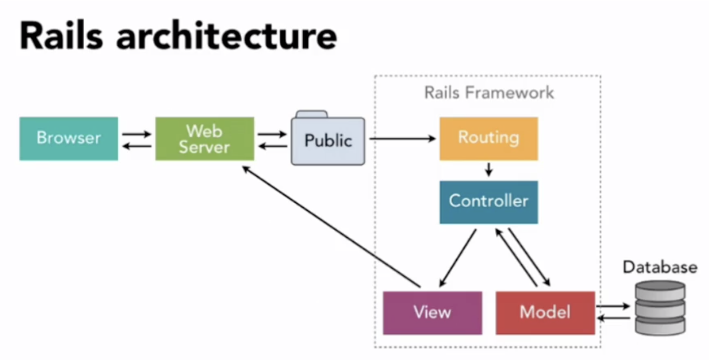
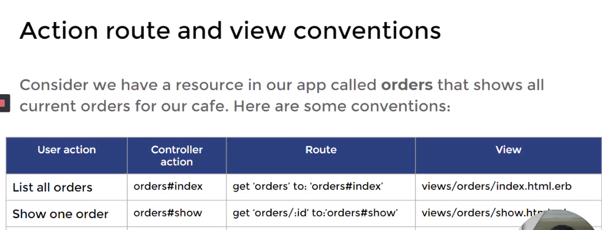

# Routes, Controllers, and Views

## Link to lesson

A link to the lesson can be found [here.](https://ait.instructure.com/courses/3520/pages/rails-routes?module_item_id=272774)

# Why Routes?

- Routing is a key part of all websites. 

- The content of a website should be organised in several URLs.

- Different URLs and different HTTP methods require different routes. 

- Routing is needed whenever we want to use a URL in our app.  

# How does Rails work?

- This image  is useful in understanding the behaviour of the rails framework. 

- The bottom of the image illustrates the MVC architecture (Model, View, Controller) 

	- The model, where we define and store the data thanks to our database. 

	- The controller, which manages everything and establishes connection between the model and the view. 

	- We can see the the view is the one that is going to show the content of the website in the browser. 

- But how does Rails know which view it has to render? To answer this, we can look at the arrows in the diagram. 

	- We can see that the HTTP request is going to arrive at the Routing first. 
	- Then, once the Routing has processed the request, the controller can start managing everything. 

# Steps of the process (overview)

1. Client sends a HTTP request.

2. Routes connects URLs to controller actions.

3. Controller executes actions and renders view. 

## Step 1: Client sends a HTTP request. 

-  When the user types a URL into the browser, and that URL points to a running rails server, the servers reads the path and looks for a route. 

- The first route that matches is the one that is uses. 

- Actually, every time we type a URL and press enter or we click on a link, a HTTP request (GET, POST, PUT/PATCH, DELETE) is sent to the server. 

## Step 2: Routes connects URLs to controller actions

- The rails server finds the first route that matches the HTTP method and path (the URL) and directs the request to the associated controller action. 

- Routes are defined in the config/routes.rb file and map HTTP verbs and paths to controller actions. 

- Controller actions are another name for controller methods and they are found in the controllers source code. 

## Step 3: Controller executes actions and renders view.

- In the controller action, the controller gets information from the model and provides that information to the view via instance variables. 

- The controller renders the view with the appropriate information from the model, and that rendered content is sent to the client (the browser viewed by the user).

- By default, the view it renders is in the views directory and has a name that matches the controller action. 

# Defining the route

- There are a few ways to define a route in config/routes.rb

- This is one of the ways to specify a route:

		HTTP_verb ‘path’ to: ‘controller_name#action_name’

**Example:** 

		get ‘orders’ to: ‘orders#index’

- In this example, if the user types a URL (which is a get method) the route will send the request to the orders controller which will execute the index action or the index method. 

# Action, Route and View conventions

## List all orders

- If the user wants to list all orders that orders controller is going to execute the index action/ index method (as per image above). 

		orders#index

- In order to define that in our config/routes.rb file we will require a *get* method because we want to get all the orders.  

		get ‘orders’ to: ‘orders#index’

- This **index method** will render a **view** from the **views directory**. 

		views/orders.index.html.erb

## Show one order

- If the user wants to see just one order. 

- The controller action that is going to execute that view is:

		orders#show

- Remembering that the **orders controller** is going to have a **show action**. 

    - In order to define this in our config/routes.rb file we will require a *get* method because we want to get an order except that path is slightly different than the first example.

		
		get ‘orders/:id to:’orders#show’

- Every time we have a collon in the URL it means that this is a **parameter** or a **param.**

- We use **parameters** when we have a **list of items** (in this example the items are orders but the can be any kind of item) and we want to **access just one**. 

- The **parameter is the item we want to access**. 

- Also, the item must have an **ID** if we want **access to it**. 

# Action, Route and View conventions (cont.)

- The **route** tells the **rails server** what to **display** when the user just types in the server URL with no additional path. 

- In other words, it is the **home** or **index** of the application. 

- The **root route** is specified in the config/routes.rb with the syntax: 

		root to: ‘controller#action’