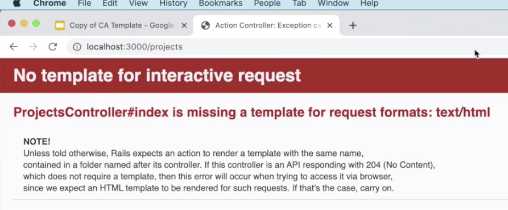

# Rails Controllers - Index:

## Link to lesson 

- A link to the lesson can be found [here.](https://ait.instructure.com/courses/3520/pages/rails-controllers?module_item_id=272775)

# What is a controller?

- The **controller** is essentially the **middle man** between our *model* or our data layer and the client side layout which is the *view*. 

- In this lesson we are going to focus on the controller. 

- Another important thing that a **controller manages** is the **requests** that are sent to our **application**. 

- It also manages the **responses** that we send back. 

- In the image above you can see the google chrome logo which represents a client computer (our computer). 

- This is interacting with an application. To do this it will send:

	- HTTP request.

- First of all it will run through the **routes file** and they will be **directed** into the **controller.** 

- Once all of the activity happens in the controller, then **controller** is then **responsible** for sending a **http response** back to the client.

- This is the premise of this lesson.

Generate a new rails app (project mgmt app)

		rails new projects_managment_app

- Hit enter and run the generator (will take roughly 30 secs)

- Next change in to your rails app

		cd projects_management_app

- Just to verify that everything is working:

		rails s

- This will start up our rails server 

- Then we go to our browser and enter:

		localhost: 3000

- You should get a page saying **“Yay you are on Rails”**

# The First Thing You Need To Do!

- The first thing you need to do before you even start a Rails application is:

	- Create some routes (or a single route). 

- So lets **stop running our rails server** and then open up the app in vs code

		code . 

- Next lets open up a file called routes.rb 

- Now we can remove the default comment.

# Define first route

- The **route** we want in this first instance is a **Get Route.** 

- A **GET request** is a request that is going to be **sent to the client.** 

- In this example, the route will be /projects  (see image below):

- This is going to go to a **controller action.**

## NOTE: none of these have been created yet. 

- For now these are **just place holders.**

- **Before** we create our **controller**, lets run our rails server:

		rails s

- Then lets go to localhost: 3000/projects 

- Because this is a **GET request**, we can make this request just from the browser. 

- In the url bar

- Now we are getting an error: 

- unititialized constat ProjectsController

- This is occuring because we are saying the route 

- Or projects controller (that's really what it means)

- And this projects controller currently DOES NOT exist. 

- So we need to create the projects controllers

## Creating projects controllers

- The slow way would be to go into our app directory

- Then go into the controllers directory and then define a new file called projects_controller.rb and then write some code in this particular file. 

- The preferred way to create a controller is (stop running server first)

- Go into terminal and use the command:

		rails g controller (name of controller)

- This is the rails controller generator command.

			rails g controller projects

- A bunch of files will be created after running this command. 

- All that we care about is the first one:

- This displays that a new file has been added to the app directory inside of the controllers directory and we now have this projects_controller.rb file (which is our controller file).

- We can see that in vs too:

## All of the controllers that we create will inherit from ApplicationController 

- This is a file that we have when we run the rails new command. 

- If we go to the ApplicationController file:

- We can see that the ApplicationController is inheriting from the ActionContoller module and the Base class in that particular module. 

- We don't really need to understand much about this apart from that fact that:

	- **Through inheritance** we have a **bunch of methods** that we can use in our **controllers** that we **DEFINE ourselves**.

- Now lets run our server again:

		rails s

Then refresh our browser.

- And we have another error:

## Whenever we see this word ACTION in realtion to a Controller:

- It is talking about a method:

	- A controller method.

- So what we are missing right now is a method in our projects controller named index.

- To fix this we go to our projects_controller.rb file and add a method called index to our ProjectsController. 

		def index
		end

- Then we can refersh in the browser. 

- And we are getting another error

- This error is a little more confusing as it can mean a number of different things. 

- What is boils down to is:

## WE ARE NOT SENDING BACK A RESPONSE TO THE CLIENT

- If we take a look at our image again:

- Our chrome client is sending a request.

- It is going through our rails router.

- And it is going to our controller. 

## The problem we currently have is:

- The controller and the action in the controller (specifically the index action)...

- IS NOT sending back a response to our client.

- There is no response being sent back so this number 8 line (in the image) is not occuring. 

# Send back a response

- To send back a response from our controller actions we have a number of different ways to do so.