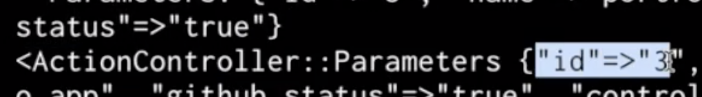

# Rails Controllers: Query String

## Link to lesson 

- A link to the lesson can be found [here.](https://ait.instructure.com/courses/3520/pages/rails-controllers?module_item_id=272775)

# Create action

- Previously we set up a Create action

- And a route that connected to the create action through a post request. 

- We found out we couldn’t test this out in the browser, we had to test this out in another app (postman): 

- In order to send a **post request** to our rails app. 

# Sending data from client side to web sever/rails app

- Often you would do this through a form like a html form.

- We are currently not working with forms because we don’t have a view. 

- What we do have instead is the actual URL. 

    - We can send some data through the URL 

    - Like sending an ID in our params to show one project.

- Before we were sending through a param

		localhost:3000/projects/1

## We will send our data differently this time. 

- Instead we will use the **query string** to send some data from our client side to our Rails app. 

# Query String

- Query string looks like this (see image below):

- The route is:

		/projects

- After the route we can add a question mark

		/projects?

- The question mark is the **start** of the **query string.** 

- Then we can **define key value pairs** in our **query string.** 

- For example: We can send across an id:

		/projects?id

- And we want that id to be equal to 3.

		/projects?id=3

- We can also send across another key value pair

    - Key value pairs need to be separated with an &

		    http://localhost:3000/projects?id=3&

- The second key value pair will be the name of the project

		http://localhost:3000/projects?id=3&name=portfolio app

- Then we want to send through the GitHub status

		http://localhost:3000/projects?id=3&name=portfolio app&github_status

- And lets set that to true

		http://localhost:3000/projects?id=3&name=portfolio app&github_status=true

## Back to Create Action

- Lets go back to our create action and *p params*:

		def create
		  p params
		end

## Now we can send a post request on postman:

## We will still get back a no content:

## But if we look at our logs and where we are printed our params, we will see that:

- We HAVE got some extra information in parameters now.

## We now have:

- The id

- The name key value pair 

- And we got the GitHub status

## So ALL OF THE INFORMATION sent through on the query string:

		http://localhost:3000/projects?id=3&name=portfolio app&github_status=true

- Can be accessed through params

			def create
			  p params
			end

# Accessing name in the project from params

			def create
			  p params[:name]
			end

- To double check that works we can send a post request through postman:

## Then take a look at our log and we can see that we are getting the name of the project (portfolio app)

## Collect information from Param and store in a variable 

		def create
		  new_project = 
		end

## And we are going to pass a hash with the id that we get from params:

		def create
		  new_project = {id: params[:id] } 
		end

## And we are also going to get params name of the project

		def create
		  new_project = {id: params[:id], name: params[:name] } 
		end

## And we are also going to get our GitHub status

		def create
		  new_project = {id: params[:id], name: params[:name], github_status: params[:githubstatus } 
		end

## NOW LETS PRINT NEW_PROJECT 

		def create
		  new_project = {id: params[:id], name: params[:name], github_status: params[:githubstatus } 
		  p new_project
		end

## THEN SEND ANOTHER POST REQUEST

- With the same information in the query string. 

- We will see in our logs we have got:

	- A hash with ALL of the values we have sent through as parameters:

# Now that we have this nicely formatted hash we can insert it into our projects  array of hashes

- We have access to the @projects instance variable in our create method because….

	def create
		  new_project = {id: params[:id], name: params[:name], github_status: params[:githubstatus } 
		  p new_project
	end

**THE BEFORE ACTION IS RUNNING before our create method!**

		before_action :read_projects

And it is **reading in the JSON file:**

# Pushing new project into our array of hashes:

- In our **create method**:

        def create
        new_project = {id: params[:id], name: params[:name], github_status: params[:githubstatus } 
        p new_project
        end

- We can get rid of p new_project and push new_project into our array of hashes (JSON)

	def create
	  new_project = {id: params[:id], name: params[:name], github_status: params[:githubstatus } 
	  @projects << new_project
	end

- Now we can print @projects

	def create
	  new_project = {id: params[:id], name: params[:name], github_status: params[:githubstatus } 
	  @projects << new_project
	  p projects
	end

 - Lets restart our rails server so we can actually see what’s happening:

		rails s

- Send a post request 

- In our terminal response we can now see we have 3 hashes 

- including our newly created hash 

NOT FINISHED VIDEO: 8:25 

