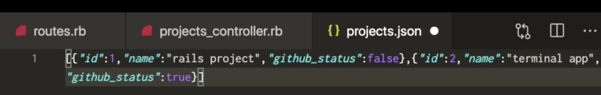

# Rails Controllers: Query String

## Link to lesson 

- A link to the lesson can be found [here.](https://ait.instructure.com/courses/3520/pages/rails-controllers?module_item_id=272775)

# Create action

- Previously we set up a **Create action**

- And a **route** that **connected** to the **create action** through a **post request**. 

- We found out we **couldn’t test** this out in the **browser**, we had to test this out in **another app (postman):** 

- In order to send a **post request** to our Rails app. 

# Sending data from client side to web sever/rails app

- Often you would do this through a **form like a html form.**s

- We are currently NOT working with forms because we don’t yet have a **view.**

- What we DO have instead is the **actual URL.**

    - We can send some data through the URL 

    - Like sending an **ID in our params** to show one project.

- Before we were sending through a param

		localhost:3000/projects/1

## We will send our data differently this time. 

- Instead we will use the **query string** to send some data from our **client side** to our Rails app. 

# Query String

- Query string looks like this (see image below):

- The route is:

		/projects

- After the route we can add a question mark

		/projects?

- The question mark is the **start** of the **query string.** 

- Then we can **define key value pairs** in our **query string.** 

- For example: We can send across an id:

		/projects?id

- And we want that id to be equal to 3.

		/projects?id=3

- We can also send across another key value pair

    - Key value pairs need to be separated with an &

		    http://localhost:3000/projects?id=3&

- The second key value pair will be the name of the project

		http://localhost:3000/projects?id=3&name=portfolio app

- Then we want to send through the GitHub status

		http://localhost:3000/projects?id=3&name=portfolio app&github_status

- And lets set that to true

		http://localhost:3000/projects?id=3&name=portfolio app&github_status=true

## Back to Create Action

- Lets go back to our create action and *p params*:

		def create
		  p params
		end

## Now we can send a post request on postman:

## We will still get back a no content:

## But if we look at our logs and where we are printed our params, we will see that:

- We HAVE got some extra information in parameters now.

## We now have:

- The id

- The name key value pair 

- And we got the GitHub status

## So ALL OF THE INFORMATION sent through on the query string:

		http://localhost:3000/projects?id=3&name=portfolio app&github_status=true

- Can be accessed through params

			def create
			  p params
			end

# Accessing name in the project from params

			def create
			  p params[:name]
			end

- To double check that works we can send a post request through postman:

## Then take a look at our log and we can see that we are getting the name of the project (portfolio app)

## Collect information from Param and store in a variable 

		def create
		  new_project = 
		end

## And we are going to pass a hash with the id that we get from params:

		def create
		  new_project = {id: params[:id] } 
		end

## And we are also going to get params name of the project

		def create
		  new_project = {id: params[:id], name: params[:name] } 
		end

## And we are also going to get our GitHub status

		def create
		  new_project = {id: params[:id], name: params[:name], github_status: params[:githubstatus } 
		end

## NOW LETS PRINT NEW_PROJECT 

		def create
		  new_project = {id: params[:id], name: params[:name], github_status: params[:githubstatus } 
		  p new_project
		end

## THEN SEND ANOTHER POST REQUEST

- With the same information in the query string. 

- We will see in our logs we have got:

	- A hash with ALL of the values we have sent through as parameters:

# Now that we have this nicely formatted hash we can insert it into our projects  array of hashes

- We have access to the @projects instance variable in our create method because….

	def create
		  new_project = {id: params[:id], name: params[:name], github_status: params[:githubstatus } 
		  p new_project
	end

**THE BEFORE ACTION IS RUNNING before our create method!**

		before_action :read_projects

And it is **reading in the JSON file:**

# Pushing new project into our array of hashes:

- In our **create method**:

        def create
          new_project = {id: params[:id], name: params[:name], github_status: params[:githubstatus } 
          p new_project
        end

- We can get rid of p new_project and push new_project into our array of hashes (JSON)

	def create
	  new_project = {id: params[:id], name: params[:name], github_status: params[:githubstatus } 
	  @projects << new_project
	end

- Now we can print @projects

        def create
          new_project = {id: params[:id], name: params[:name], github_status: params[:githubstatus } 
          @projects << new_project
          p projects
        end

 - Lets restart our rails server so we can actually see what’s happening:

		rails s

- Send a post request 

- In our terminal response we can now see we have 3 hashes 

- including our newly created hash 

# Write the newly created array to JSON file

- In order to write this new array into our JSON file we are going to define a new method

- Note: Our array is @projects

		def write_projects(projects)

		end 

- The method will take projects as aim argument (which is our newly created array)

- The actually method is going to be similar to the read JOSN method.

- Instead of File.read we are going to use File.write

		File.write

- And write takes TWO arguments.

## ARGUMENT ONE:

- It takes the file path (which is the same as what we had with File.read)

- Using the public_path.join notation

		File.write(Rails.public_path.join(“projects.json”))

## ARGUMENT TWO:

- Which is whatever you want to actually write to (that particular file - this in case it is projects).

			File.write(Rails.public_path.join(“projects.json”)), projects)

- **NOTE projects is an array of hashes** 

# Calling the write_projects method

- Let’s call our write_projects method inside of our create method.

		def create
		  new_project = {id: params[:id], name: params[:name], github_status: params[:githubstatus } 
		  @projects << new_project
		  write_project(@project)
		end

## So in our create method we have push the new project into our array of hashes:

		@projects << new_project

- Then we are parsing that particular array of hashes (@projects):

- To our write_projects method as an argument 

		write_projects(@projects)

## One more thing to do to @projects

- Currently @projects is just an array of hashes.

- But that won’t work with JSON format. 

# Formatting @projects

- We need to call the json.generate method in our write projects method

		def write_projects(projects)
		  File.write(Rails.public_path.join(“projects.json”)), JSON.generate(projects)
		end

# Render plain text

- Lets go to our create method and render some plain text

	def create
	  new_project = {id: params[:id], name: params[:name], github_status: params[:githubstatus } 
	  @projects << new_project
	  write_project(@project)
	  render plain “successfully added to projects!”
	end

# Run this again!

- Send our post request and will receive a response.

# Double checking it added to our json file

- lets go to our projects.json file

- We can see that it our projects.json has been written to and received this object/this hash with:

	- The id
	- The name
	- The GitHub status

- If we go back to the browser and refresh 

- We are now getting the project we just created:

- Because it is a part of the json file, it is now included in this response. 

# Individual projects

- We can find projects 1

		localhost:3000/projects/1

- And we will get the first project

- We can do the same for the second project

		localhost:3000/projects/2

- BUT we get null when we try the third project

		localhost:3000/projects/3

# Why null?

- The problem is we are writing the id to our json file as a string.

- To overcome this, lets first manually delete this project from our json file.

# Fixing null?

- And lets go back to our controller (projects_controller.rb)

## What we are going to have to do is: 

 - Convert the id that is passed through params to an integer 

		
		def create
	  	  new_project = {id: params[:id].to_i, name: params[:name], github_status: params[:githubstatus } 
	  	  @projects << new_project
	  	  write_project(@project)
		end

# Save and send post request again to check for reading project 3

- Save project and send a post request

- Will see we have a response “successfully added to projects!”

- Now lets look at the json file

- And id is now an integer

- Then we can come back to the browser and check if we get project 3

		localhost:3000/projects/3

- And you can now access project 3 

