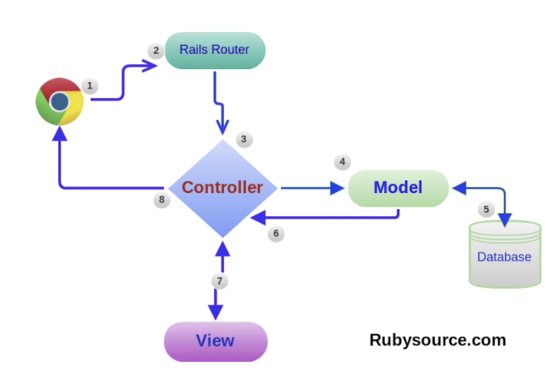
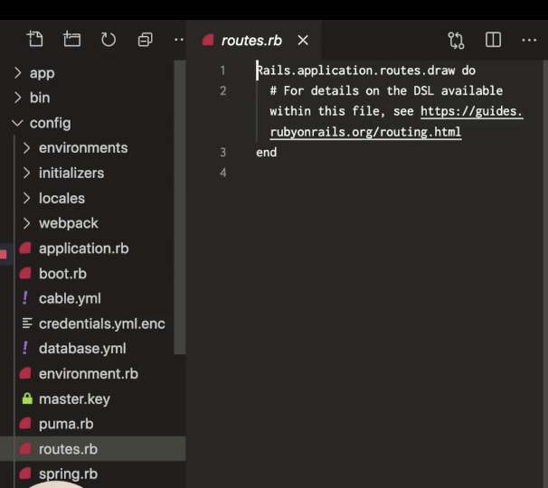
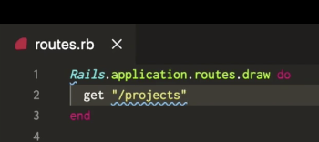
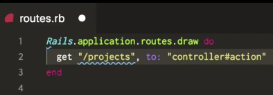
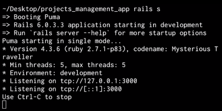
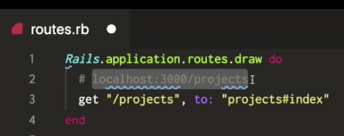
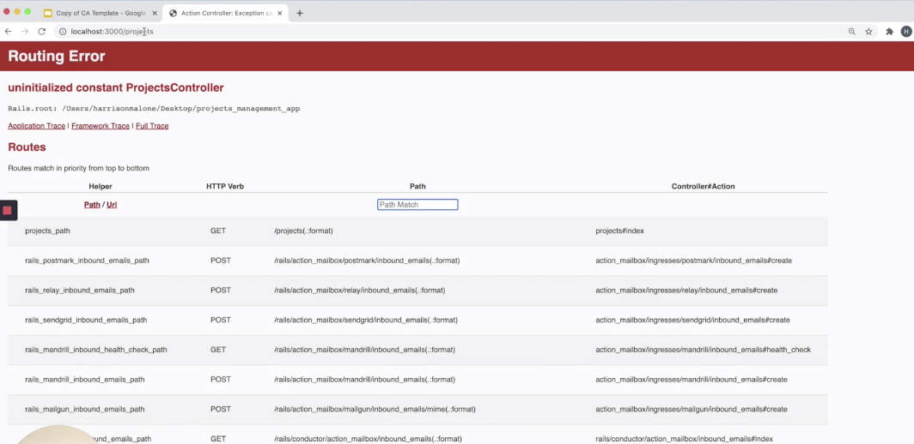

# Rails Controllers - Index:

## Link to lesson 

- A link to the lesson can be found [here.](https://ait.instructure.com/courses/3520/pages/rails-controllers?module_item_id=272775)

# What is a controller?

- The controller is essentially the **middle man** between our *model* or our data layer and the client side layout which is the *view*. 

- In this lesson we are going to focus on the controller. 

- Another important thing that a **controller manages** is the **requests** that are sent to our **application**. 

- It also manages the **responses** that we send back. 

- In the image above you can see the google chrome logo which represents a client computer (our computer). 

- This is interacting with an application. To do this it will send:

	- HTTP request.

- First of all it will run through the routes file and they will be directed into the controller. 

- Once all of the activity happens in the controller, then controller is then responsible for sending a http response back to the client.

- This is the premise of this lesson.

Generate a new rails app (project mgmt app)

		rails new projects_managment_app

- Hit enter and run the generator (will take roughly 30 secs)

- Next change in to your rails app

		cd projects_management_app

- Just to verify that everything is working:

		rails s

- This will start up our rails server 

- Then we go to our browser and enter:

		localhost: 3000

- You should get a page saying “Yay you are on Rails”

The First Thing You Need To Do!

- The first thing you need to do before you even start a Rails application is:

	- Create some routes (or a single route). 

- So lets stop running our rails server and then open up the app in vs code

		code . 

- Next lets open up a file called routes.rb 

- Now we can remove the default comment.

# Define first route

- The route we want in this first instance is a Get Route. 

- A GET request is a request that is going to be sent to the client. 

- In this example, the route will be /projects  (see image below):

- This is going to go to a controller action.

- NOTE: none of these have been created yet. 

- For now these are just place holders.

- Before we create our controller, lets run our rails server:

		rails s

- Then lets go to localhost: 3000/projects 

- Because this is a get request, we can make this request just from the browser. 

- In the url bar

NOT FINISHED 6:30

