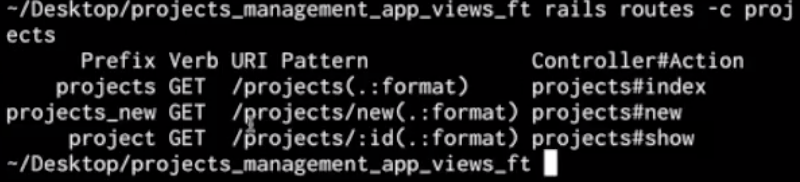
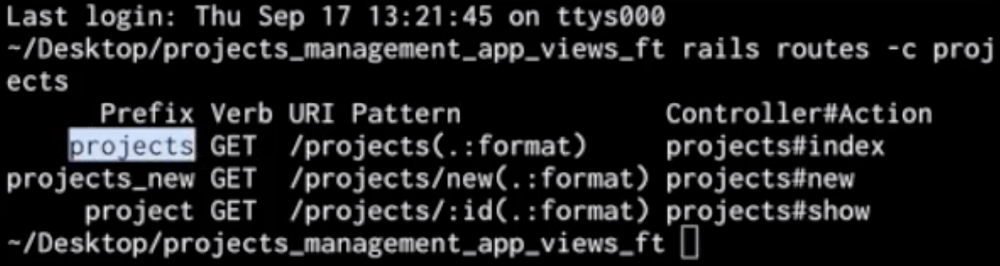
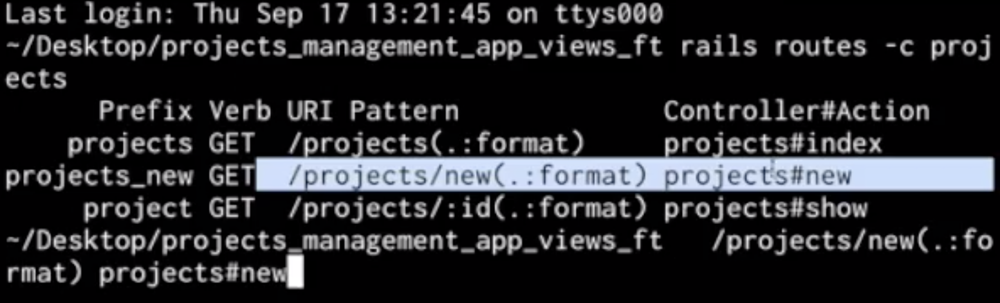
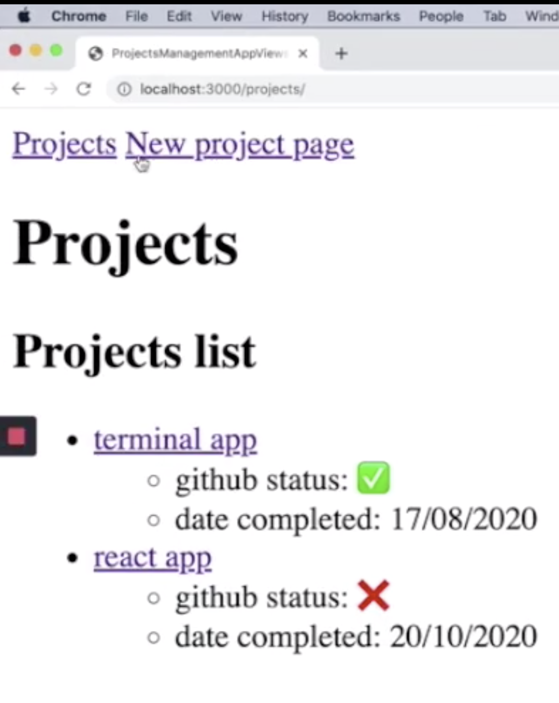
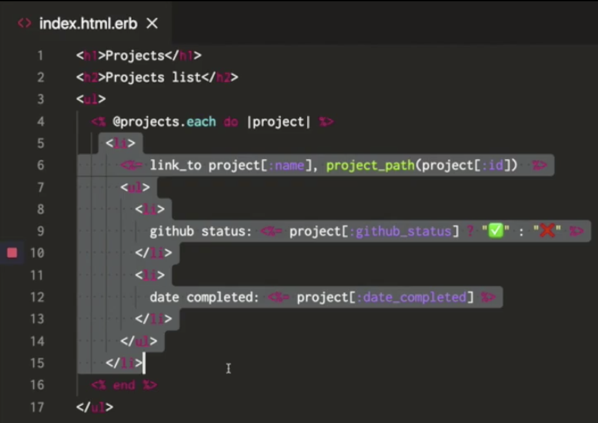
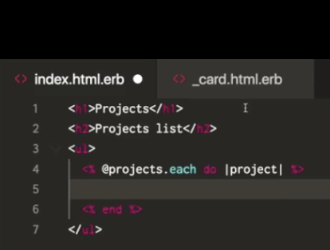
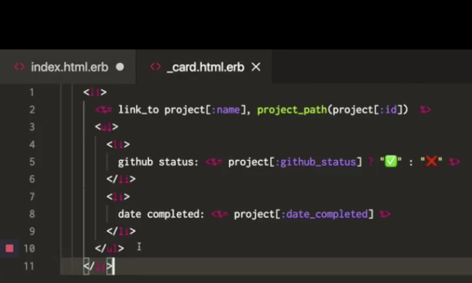
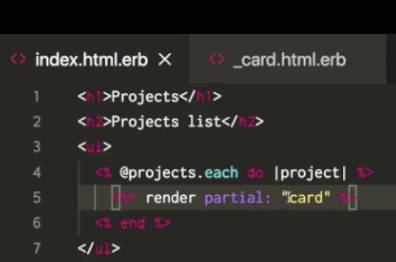
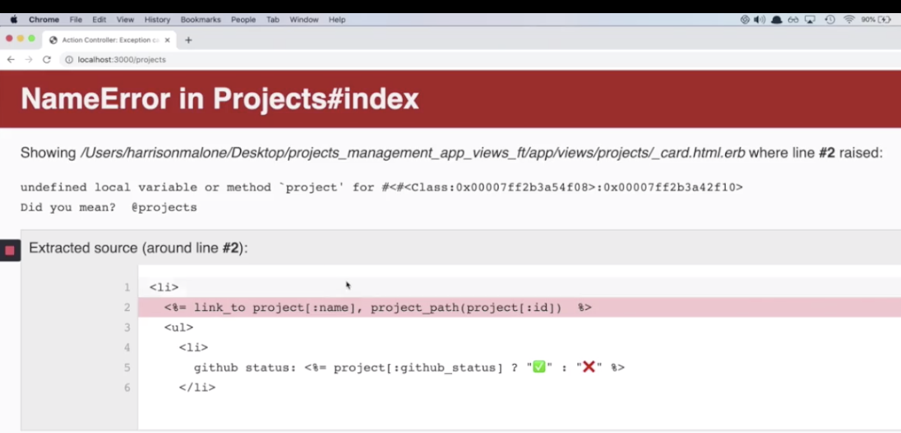

# TERM 2: Week 2 Views - Partials 

## Link to lesson 

- A link to the lesson can be found [here.](https://ait.instructure.com/courses/3520/pages/rails-views?module_item_id=272776)

# What is a partial?

- A partial is a chunk of html that you can define one in one file.

- Because it is a partial, you can parse it around to different files easily (without copy and paste all the html). 

- Think back to our portfolio project and our nav bars 

- This nav bar was included in ALL html documents (copy and paste into each html doc)

- In other words, you were repeating yourself

- Partials seek to solve this problem 

# Layout file

- can be found in views/layouts 

- All of our files are loaded into this file. 

- The layout file is can be consider the entry point for all of our other views files. 

# Yield

		<body>
		    <%= yield %>
		</body>

- This yield is where the actual view that we have defined away from this application.html.erb file 

- For example index.html.erb

- All of the content in index.html.erb will load from yield

		<body>
		    <%= yield %>
		</body>

# Navbar partial 

- We are going to put the nabber partial above the yield in our index.html.erb file

		<body>
		    #<% navbar partial %>
		    <%= yield %>
		</body>

- This way it will be load on every single page of our app. 

# Navbar is a shared partial 

- The navbar is going to be a shared partial.

- It will be shared amongst multiple different pages. 

- It doesn’t really belong to a  controller, rather it belongs to the entire project. 

# Defining a shared partial 

- The place where we define a shared partial across the entire project is we usually put it in a shared directory.

- You can create a directory names shared with the view directory.

- In the shared directory, you can define a new file.

# Partial file notation 

- Partial file notation will have an underscore at the beginner of the file name

	_nav.html.erb

- If you see an underscore it is a partial 

## Inside _nav.html.erb

		<nav>
		
		</nav>

- Inside our navbar we are going to have some links to different pages in our app

- We can use the link to method to link to different pages and create links

		
		<nav>
		  <%= link_to  %>
		</nav>

- This link to method takes text as the first argument 

		<nav>
		  <%= link_to  “Projects” %>
		</nav>

- The second argument that we pass to the link to in the path

- We can figure out the path of our index page we go to the command line and run

		rails routes - c projects

- You can see that we have three prefix’s 

- If we want to make a path for projects index it is going to be projects_path

		<nav>
		  <%= link_to  “Projects”, projects_path %>
		</nav>

# Projects link

		<nav>
		  <%= link_to  “Projects”, projects_path %>
		</nav>

# New Projects link

- If we want to make a path for new projects 

          <nav>
		  <%= link_to  “New Projects Page”, projects_new_path %>
		</nav>

## Both links

		<nav>
		  <%= link_to  “Projects”, projects_path %>
		  <%= link_to  “New Projects Page”, projects_new_path %>
		</nav>

## Save and run server

- Now that we have defined our partial in _nav.html.erb

- We can come back to our application.html.erb file 

- And we can remove our navbar partial comment 

		<body>
		    #<% navbar partial %>
		    <%= yield %>
		</body>

- Then we need to use the erb tag with = 

		<body>
		    <%= %>
		    <%= yield %>
		</body>

- Then inside this tag to access a partial we need to render:

		<body>
		    <%= render %>
		    <%= yield %>
		</body>

- Then we need to add the keyword partial:

		<body>
		    <%= render partial: %>
		    <%= yield %>
		</body>

- And then what goes with this partial key is a path to the partial as a string.

- In this case the path to the partial is going to be:

	- Shared and then _nav.html.erb

## NOTE: we ignore views, we don’t have to define the path for views. 

		<body>
		    <%= render partial: shared/nav %>
		    <%= yield %>
		</body>

## NOTE: we don’t have to do underscore.

# Back to browser and refresh 

- We will have our navbar appearing

# Defining a card partial 

- The list item we have in our index.html.erb file

- Lets put that in its own seperate partial.  

- This will allow us to clean up  our code in index.html.erb

- This is going to be a card partial or we could call it a project partial since it’s going to be ONE SINGLE project. 

- This is NOT going to be defined in shared directory.  

- it WILL be in the projects directory within our views directory. 

- This is because this particular partial is going to be accosted with our projects. 

# Make new file in projects directory 

- Make a new file in the projects directory 

- _card.html.erb

# Copy from index to card

- We can copy our list (image above) and take it out of our index.html.erb file:

- And paste it into our _card.html.erb file:

# Render partial from index.html.erb

- This will be similar to how we rendered the navbar partial.

- The reason we can pass in card alone is because Rails is smart enough to know that:

    - because we are in the projects directory and
    - because we are in the projects view file
    - that we just want to render out the partial that is inside the projects directory (rails magic)

# Problems we will now face - local variable

- The car partial created has the project variable. 

- To solve this, we are going to have to pass it the project so it has access to the project variable. 

- in order to do that, we can pass a second argument to the key word render:

		<h1>Projects</h1>
		<h2>Projects list</h2>
		<ul>
    		    <%= render partial: “card”, locals: {project: project} %>
    		    <% end %>
		</ul>

- If we save and refresh, it will now works:

# Recap:

- We created a partial called card.

- Project is being passed through. 

- And project is now accessible in this view. 

- So everything is working as it was being but we have a more modular and cleaner index view. 

